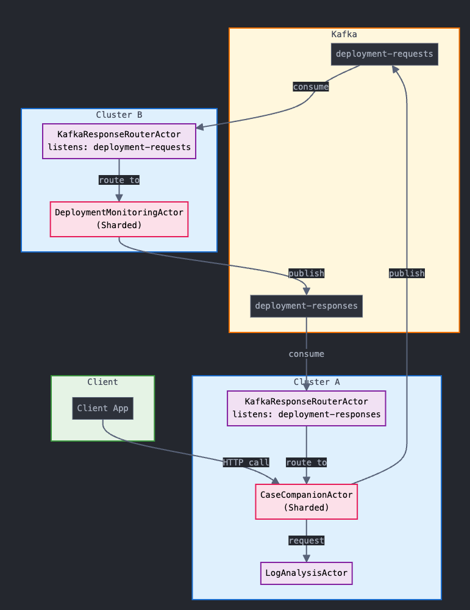

# Pekko Clustered Architecture Demo (Kafka based)

## **🚀 QUICK INSTALL**

**1. Start Docker on your Mac**

**2. Run:**
```bash
./restart.sh
```

**3. Test the system:**
```bash
curl -X POST http://localhost/api/v1/cases/resolve \
  -H "Content-Type: application/json" \
  -d '{"caseId": "test-case-123"}'
```

---

## Overview

This project demonstrates a modern distributed system architecture using Apache Pekko Cluster with Kafka-based communication between clusters. 

The following features are showcased:

- **Http connectivity with the front actor remains**
- **Kafka connectivity between clusters. That means async communication. Please note, in-cluster async managed by PubSub**
- **Actor state persistency**
- **Sharded actor management, now sharded actor in the second cluster too**
- **Shard/actor failover and recovery**
- **Fine-tuned actor configuration for performance and reliability**

---

## Architecture

The system is composed of two main clusters and several key actors. The architecture and communication flow are illustrated in the following diagrams:

### Actors communication



This diagram shows the overall structure of the system, including the two clusters and their main components.

### Clusters 


This diagram details the flow of messages and interactions between the main actors and services within and across clusters.

---

## Sharded CaseCompanionActor: Management and Routing

- **Sharding:**
  - `CaseCompanionActor` is managed using Pekko Cluster Sharding.
  - Each case (identified by `caseId`) is routed to its own actor instance (shard), ensuring state and processing isolation per case.
  - Sharding is initialized in `ClusterApp.java` and uses the `caseId` as the entity key.
- **Persistence:**
  - Each `CaseCompanionActor` persists its state using Pekko Persistence, ensuring durability and recovery.
- **Routing:**
  - HTTP requests are unmarshalled and routed to the correct actor instance via the sharding mechanism.
  - Replies are handled asynchronously using a temporary proxy actor to bridge between the actor system and the HTTP layer.
  - **Now, the same sharding mechanism is also used to route returning messages from Cluster2 back to the correct `CaseCompanionActor` instance, ensuring that responses from the remote cluster are delivered to the right case handler.**

### How DistributedPubSub Contributes to Message Routing

The system uses Pekko's DistributedPubSub to enable decoupled, cross-node communication for case resolution responses. When a case resolution request is made, a temporary ResponseSubscriber actor subscribes to a unique topic via the DistributedPubSub mediator. The CaseCompanionActor, after processing the request and gathering results (including from other clusters if needed), publishes the response to this topic. The ResponseSubscriber receives the response via pub-sub, forwards it to the HTTP layer, and then stops itself. This approach allows for:
- Asynchronous, location-transparent delivery of responses across the cluster
- Decoupling of requesters and responders (they do not need direct references to each other)
- Scalability and resilience, as any node can handle the response publication and subscription

This pattern is especially useful for workflows that span multiple nodes or clusters, as it avoids tight coupling and enables robust, distributed message routing.

---

## Sharded DeploymentMonitoringActor: Management and Routing

- **Sharding:**
  - `DeploymentMonitoringActor` is managed using Pekko Cluster Sharding in Cluster B (Ops Service).
  - Each deployment status check (identified by `caseId`) is routed to its own actor instance (shard), ensuring isolation and scalability for deployment monitoring tasks.
  - Sharding is initialized in `ClusterApp.java` for Cluster B and uses the `caseId` as the entity key.
- **Kafka-based Routing:**
  - Requests for deployment status are received from Cluster A via Kafka (`deployment-requests` topic).
  - The `KafkaResponseRouterActor` in Cluster B consumes these requests and routes them to the correct `DeploymentMonitoringActor` shard based on `caseId`.
  - After processing, the `DeploymentMonitoringActor` sends the deployment status response back to Cluster A via Kafka (`deployment-responses` topic), using the same `caseId` for correlation.
  - This design ensures robust, decoupled, and scalable inter-cluster communication for deployment status checks.

---

## KafkaResponseRouterActor: Cross-Cluster Kafka Routing

The `KafkaResponseRouterActor` is a specialized actor used in both clusters to bridge Kafka topics and the actor system:

- **Purpose:**
  - Listens to a Kafka topic as a consumer and routes incoming messages to the appropriate sharded actor based on injected routing logic.
- **Usage in Cluster A:**
  - Consumes deployment status responses from the `deployment-responses` Kafka topic.
  - Routes each response to the correct `CaseCompanionActor` shard using the `caseId` from the message, ensuring the right case handler receives the result from Cluster B.
- **Usage in Cluster B:**
  - Consumes deployment status requests from the `deployment-requests` Kafka topic.
  - Routes each request to the correct `DeploymentMonitoringActor` shard using the `caseId`, triggering the deployment status check and response.
- **Extensibility:**
  - The actor is generic and can be configured for different topics and message types, making it reusable for other cross-cluster communication patterns.

---

## Starting the System: Docker Compose

To start the entire system (both clusters and supporting services) locally, simply run:

```bash
./restart.sh
```

This script will:
- Build and start all required Docker containers (Cluster A, Cluster B, Kafka, Zookeeper, Postgres, etc.).
- Set up networking automatically.
- Expose the HTTP API for Cluster A on `localhost` (default port: 80).

---

## Testing the System: Resolve a Case

Once the system is running, you can test the end-to-end flow by sending a case resolution request:

```bash
curl -X POST http://localhost/api/v1/cases/resolve \
  -H "Content-Type: application/json" \
  -d '{"caseId": "test-case-123"}'
```

- This will trigger the full orchestration:
  - The request is routed to the correct `CaseCompanionActor` shard.
  - Log analysis and deployment status checks are performed.
  - The final resolution is returned as the HTTP response.

To monitor relevant events and actions in the system, you can filter the logs for key events using the following command in your terminal:

```bash
docker-compose logs -f seed-node-a node-1 node-2 seed-node-b node-b1 node-b2 | grep "pocrun"
```

This will display only the log lines containing pocrun, making it easier to observe important events and actor activities across all cluster nodes.

|  |
|---|

You should see cats, mice, and dogs in the logs:
- 🐱 Cat: `CaseCompanionActor`
- 🐭 Mouse: `LogAnalysisActor`
- 🐶 Dog: actor in a different cluster (`DeploymentMonitoringActor`)

---

## Persistence Example: Actor State Counter

Persistence is shown in the response: this counter (see image below) is a persisted state of the actor.

|  |
|---|

## Summary

- **Two clusters**: Case Resolver (A) and Ops Service (B), communicating via Kafka topics.
- **Sharded, persistent actors**: Each case and deployment check is handled by its own actor instance in the respective cluster.
- **Kafka-based cross-cluster routing**: Kafka topics are used for robust, decoupled communication between clusters, with sharding ensuring correct message delivery.
- **Easy local start**: Use `./restart.sh` to spin up the full system in Docker.
- **Simple test**: Use `curl` to trigger a case resolution and observe the distributed workflow in action.

For more details, see the source code and comments in the `src/main/java/com/example/cluster/` directory. 

--- 

---

## Problems

1) **Dead letters for Timeout messages**

   If you see a log like this:
   
   ```
   Message [com.example.cluster.commands.TimeoutCommand] to Actor[pekko://ClusterA/system/response-subscriber-...] was not delivered.
   ```
   
   This is expected and considered normal for temporary actors serving with PubSub. These actors are closed before the timeout message is delivered, and it is considered overkill to prevent that. The dead letter is harmless in this context.

2) **Need to call twice after killing a node with the shared actor**

   If you notice that you need to call the cluster endpoint twice to get a response after you have (for experiment) killed a node with the shared actor, it is most likely because the open-source version of NGINX (used as load balancer) works in "passive" mode. It recognizes cluster changes only after failed requests, so it may route to a dead node until a failure is detected. Pekko itself re-establishes cluster awareness quite quickly, but the load balancer may lag behind until it observes a failure. 

   Now with Kafka that needs to reconcile consumers, it could be even worse, but hope - not!